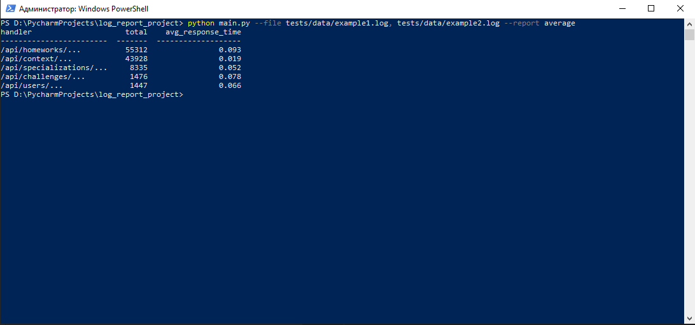

# Log Report Project

Скрипт на Python для обработки лог-файлов в формате JSON и генерации отчётов по эндпоинтам.

## Что делает скрипт?

- Принимает один или несколько лог-файлов через параметр `--file`
- По параметру `--report` генерирует отчёт:
  - `average` — среднее время ответа по каждому эндпоинту
- Выводит результат в виде таблицы в консоль
- Поддерживает фильтрацию по дате через параметр `--date` (например: `--date 2025-06-22`)

## Примеры запуска

```bash
python main.py --file tests/data/example1.log --report average

- C несколькими файлами:
python main.py --file tests/data/example1.log, tests/data/example2.log --report average

- C указанием даты:

python main.py --file tests/data/example1.log, tests/data/example2.log --report average --date 2025-06-22
